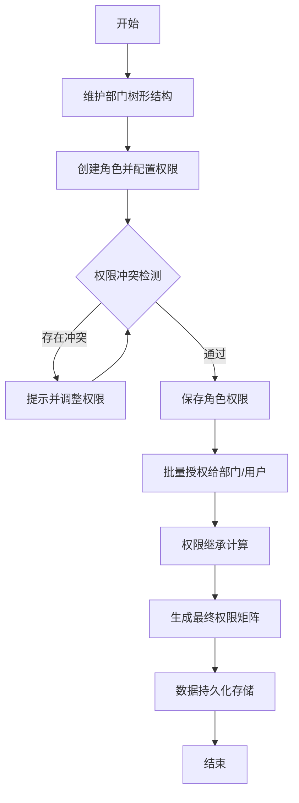

## 1. 产品概述

企业级多级树形权限管理系统，基于 Vue3 + Vite + Pinia 技术栈构建，解决企业复杂组织结构下的权限精细化管理问题。面向系统管理员、IT 运维人员，提供直观、高效、可审计的权限管控能力。

通过树形结构可视化展示组织层级与权限关系，实现权限的精确分配、继承与冲突检测，提升企业信息安全管理水平。

## 2. 核心功能

### 2.1 用户角色

| 角色 | 注册方式 | 核心权限 |
|------|----------|----------|
| 系统管理员 | 系统内置 | 全功能访问、角色创建、权限分配、批量授权、数据管理 |
| 部门管理员 | 系统分配 | 本部门及子部门权限管理、角色查看、人员授权 |
| 普通用户 | 系统分配 | 个人权限查看、权限申请提交 |

### 2.2 功能模块

1. **部门管理页**：树形结构展示组织架构、节点折叠展开、搜索高亮、部门信息维护
2. **角色管理页**：角色 CRUD 操作、角色权限配置、角色人员关联
3. **权限管理页**：权限树形展示、父子节点联动、半选状态、批量勾选、权限冲突校验
4. **授权管理页**：批量授权操作、权限继承关系展示、授权日志查看

### 2.3 页面详情

| 页面名称 | 模块名称 | 功能描述 |
|---------|---------|----------|
| 部门管理 | 树形展示 | 多层级部门树形渲染、节点图标、层级缩进连接线 |
| 部门管理 | 节点操作 | 新增/编辑/删除部门、节点折叠展开全部、展开到指定层级 |
| 部门管理 | 搜索功能 | 部门名称模糊搜索、搜索结果高亮、自动展开匹配节点路径 |
| 角色管理 | 角色列表 | 角色卡片展示、角色状态标签、角色成员数量统计 |
| 角色管理 | 权限配置 | 权限树勾选、权限继承设置、权限保存校验 |
| 权限管理 | 树形勾选 | 父子节点联动勾选、全选/半选/未选三态展示 |
| 权限管理 | 冲突检测 | 互斥权限校验、权限范围重叠提示、冲突列表展示 |
| 授权管理 | 批量操作 | 多选部门/角色、批量分配权限、批量撤销权限 |
| 授权管理 | 继承关系 | 权限继承链路可视化展示、继承路径高亮 |
| 全局功能 | 数据持久化 | localStorage 本地存储、数据自动保存、手动导入导出 |
| 全局功能 | 响应式布局 | 多分辨率适配、侧边栏折叠、内容区域自适应 |

## 3. 核心流程

系统管理员登录后，首先维护组织架构，创建部门树形结构；然后根据管理需要创建不同角色并配置对应权限；最后将角色授权给指定部门或用户。权限配置过程中系统自动检测父子节点关联关系和权限冲突，确保权限体系的一致性。

## 4. 用户界面设计

### 4.1 设计风格

- **主色调**：深邃科技蓝 `#1e40af`，象征专业与可信
- **辅助色**：翡翠绿 `#059669`（成功/启用）、琥珀橙 `#d97706`（警告/半选）、玫红 `#dc2626`（错误/冲突）
- **中性色**：深灰 `#1f2937`、中灰 `#6b7280`、浅灰 `#f3f4f6`
- **按钮风格**：圆角 6px，细微阴影，hover 状态微抬升动效
- **字体**：主字体采用 Inter 现代无衬线字体，标题字重 600，正文 400
- **布局风格**：三栏式卡片布局，左侧导航、中间主内容区、右侧配置面板
- **图标风格**：线性图标，统一 16px 尺寸，与文字保持 4px 间距

### 4.2 页面设计概述

| 页面名称 | 模块名称 | UI 元素 |
|---------|---------|---------|
| 部门管理 | 树形区 | 树形连接线、折叠动画、高亮效果、层级缩进、节点状态图标 |
| 部门管理 | 搜索栏 | 圆角输入框、搜索图标、清除按钮、结果计数 |
| 角色管理 | 角色卡片 | 卡片阴影、hover 缩放、权限标签、成员头像组 |
| 权限管理 | 权限树 | 三态复选框、连接线、禁用状态、冲突标记、半选效果 |
| 权限管理 | 冲突面板 | 红色警示条、冲突详情列表、快速修复按钮 |
| 授权管理 | 批量操作 | 多选框组、进度条、操作确认模态框、结果提示 |
| 全局 | 导航栏 | 渐变背景、active 下划线、折叠动画、面包屑 |

### 4.3 响应式

采用桌面优先设计，断点设置：
- **≥1920px**：超大屏，四栏扩展布局，更多信息并列展示
- **1440px - 1920px**：标准大屏，三栏式布局
- **1024px - 1440px**：中等屏幕，两栏式布局，右侧面板可抽屉式呼出
- **768px - 1024px**：平板设备，左侧导航折叠为图标模式
- **<768px**：移动设备，底部 Tab 导航，卡片堆叠布局

触控优化：按钮最小触控区域 44x44px，树形节点点击区域扩展，滚动惯性支持。

### 4.4 动画与交互

- 节点折叠/展开：CSS transform 300ms cubic-bezier(0.4, 0, 0.2, 1)
- 搜索高亮：背景色渐变过渡 200ms
- 复选框状态切换：SVG path 动画 150ms
- 冲突检测：脉冲提示动画，每秒 1 次，持续 3 秒
- 页面切换：淡入淡出 + 轻微位移 300ms
