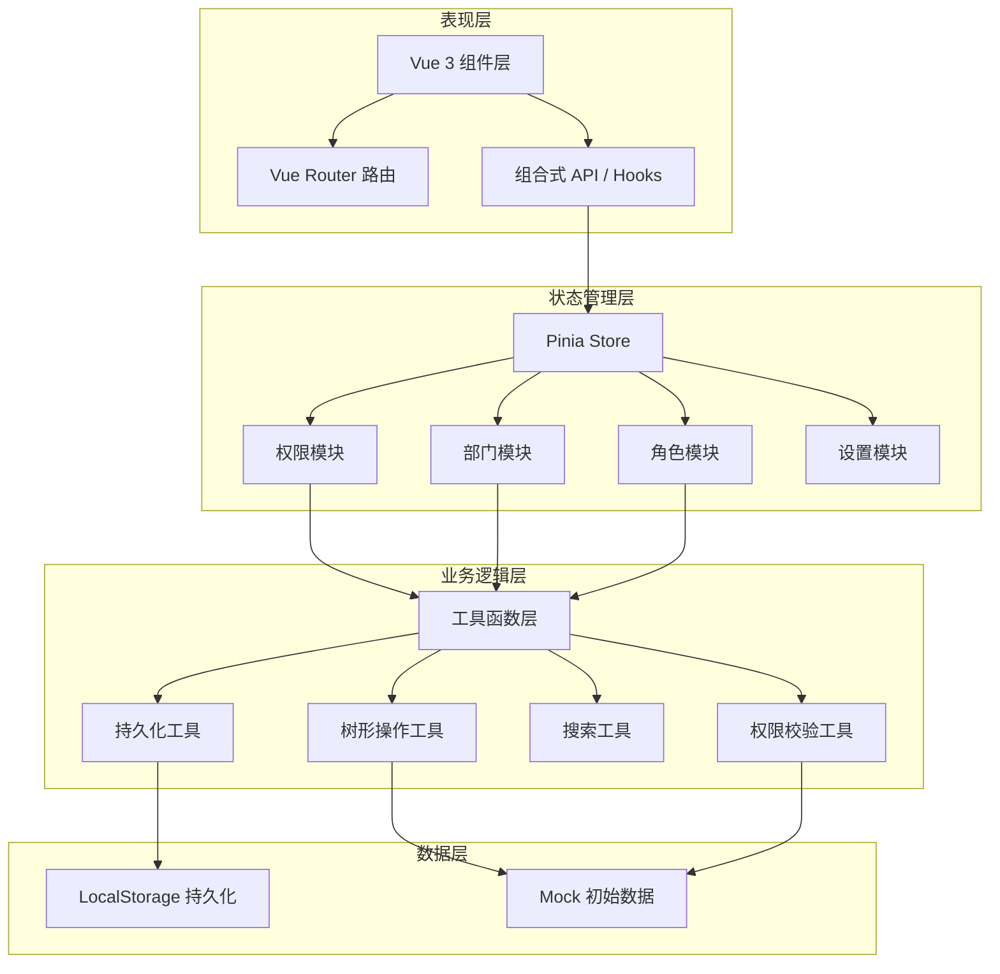

## 1. 架构设计



## 2. 技术描述

- **前端框架**：Vue 3.4.x + `<script setup>` 语法糖 + TypeScript 5.x
- **构建工具**：Vite 5.x，配置路径别名、按需加载、热更新
- **状态管理**：Pinia 2.x，模块化 store，持久化插件
- **路由管理**：Vue Router 4.x，路由懒加载，导航守卫
- **UI 样式**：Tailwind CSS 3.x + SCSS 变量，CSS 响应式
- **图标方案**：Lucide Vue Next，按需导入，SVG 渲染
- **开发工具**：Vue DevTools，Pinia DevTools，ESLint + Prettier
- **数据持久化**：localStorage + 版本管理 + 数据迁移
- **测试方案**：Vitest + Vue Test Utils，单元测试覆盖核心逻辑

## 3. 核心数据结构定义

### 3.1 部门节点 (DepartmentNode)

```typescript
interface DepartmentNode {
  id: string;
  name: string;
  code: string;
  parentId: string | null;
  children: DepartmentNode[];
  level: number;
  expanded: boolean;
  description: string;
  leader?: string;
  memberCount: number;
  order: number;
  createdAt: number;
  updatedAt: number;
}
```

### 3.2 权限节点 (PermissionNode)

```typescript
interface PermissionNode {
  id: string;
  name: string;
  code: string;
  type: 'menu' | 'button' | 'api' | 'data';
  parentId: string | null;
  children: PermissionNode[];
  checked: boolean;
  indeterminate: boolean;
  disabled: boolean;
  conflictingPermissions: string[];
  inherited: boolean;
  inheritedFrom?: string;
  description: string;
  order: number;
}
```

### 3.3 角色 (Role)

```typescript
interface Role {
  id: string;
  name: string;
  code: string;
  description: string;
  permissionIds: string[];
  departmentIds: string[];
  userIds: string[];
  isSystem: boolean;
  status: 'active' | 'disabled';
  inheritFromRole?: string;
  createdAt: number;
  updatedAt: number;
}
```

### 3.4 树节点操作状态 (TreeState)

```typescript
interface TreeState {
  searchKeyword: string;
  matchedIds: Set<string>;
  expandedIds: Set<string>;
  selectedId: string | null;
  checkedIds: Set<string>;
  indeterminateIds: Set<string>;
}
```

### 3.5 权限冲突 (PermissionConflict)

```typescript
interface PermissionConflict {
  id: string;
  type: 'mutex' | 'overlap' | 'scope';
  permissionA: string;
  permissionB: string;
  severity: 'high' | 'medium' | 'low';
  description: string;
  resolved: boolean;
}
```

## 4. 目录结构

```
src/
├── main.ts
├── App.vue
├── vite-env.d.ts
├── router/
│   └── index.ts
├── stores/
│   ├── index.ts
│   ├── department.ts
│   ├── permission.ts
│   ├── role.ts
│   └── app.ts
├── composables/
│   ├── useTree.ts
│   ├── usePermissionCheck.ts
│   ├── useSearch.ts
│   └── usePersistence.ts
├── utils/
│   ├── treeUtils.ts
│   ├── permissionUtils.ts
│   ├── searchUtils.ts
│   └── storage.ts
├── components/
│   ├── tree/
│   │   ├── TreeNode.vue
│   │   ├── TreeView.vue
│   │   └── TreeCheckbox.vue
│   ├── department/
│   │   ├── DepartmentTree.vue
│   │   └── DepartmentForm.vue
│   ├── role/
│   │   ├── RoleCard.vue
│   │   ├── RoleList.vue
│   │   └── RolePermissionConfig.vue
│   ├── permission/
│   │   ├── PermissionTree.vue
│   │   └── ConflictPanel.vue
│   └── common/
│       ├── SearchBar.vue
│       ├── BatchActionBar.vue
│       └── ConfirmModal.vue
├── views/
│   ├── DepartmentView.vue
│   ├── RoleView.vue
│   ├── PermissionView.vue
│   └── AuthView.vue
├── types/
│   └── index.ts
├── mock/
│   └── initialData.ts
├── styles/
│   ├── variables.scss
│   └── global.scss
└── tests/
    ├── treeUtils.test.ts
    ├── permissionUtils.test.ts
    └── components/
```

## 5. 核心算法说明

### 5.1 父子节点联动算法

```typescript
// 勾选时向上遍历更新祖先节点半选状态
function updateParentState(node: TreeNode, tree: TreeNode[]): void {
  const parent = findParent(node.parentId, tree);
  if (!parent) return;
  
  const children = parent.children;
  const allChecked = children.every(c => c.checked);
  const someChecked = children.some(c => c.checked || c.indeterminate);
  
  parent.checked = allChecked;
  parent.indeterminate = !allChecked && someChecked;
  
  updateParentState(parent, tree);
}

// 勾选时向下遍历更新子孙节点状态
function updateChildrenState(node: TreeNode, checked: boolean): void {
  node.checked = checked;
  node.indeterminate = false;
  node.children.forEach(child => updateChildrenState(child, checked));
}
```

### 5.2 搜索高亮算法

```typescript
function searchTree(keyword: string, tree: TreeNode[]): SearchResult {
  const matchedIds = new Set<string>();
  const expandedIds = new Set<string>();
  
  function traverse(node: TreeNode, path: string[]): boolean {
    const matched = node.name.toLowerCase().includes(keyword.toLowerCase());
    let childMatched = false;
    
    path.push(node.id);
    node.children.forEach(child => {
      if (traverse(child, [...path])) childMatched = true;
    });
    path.pop();
    
    if (matched) {
      matchedIds.add(node.id);
      path.forEach(id => expandedIds.add(id));
    }
    
    return matched || childMatched;
  }
  
  tree.forEach(root => traverse(root, []));
  return { matchedIds, expandedIds };
}
```

### 5.3 权限继承与冲突检测算法

```typescript
function calculateInheritedPermissions(
  roleId: string, 
  roles: Role[], 
  permissions: PermissionNode[]
): string[] {
  const role = roles.find(r => r.id === roleId);
  if (!role) return [];
  
  const inherited = new Set<string>(role.permissionIds);
  
  if (role.inheritFromRole) {
    const parentPermissions = calculateInheritedPermissions(
      role.inheritFromRole, roles, permissions
    );
    parentPermissions.forEach(p => inherited.add(p));
  }
  
  return Array.from(inherited);
}

function detectConflicts(permissionIds: string[], allPermissions: PermissionNode[]): PermissionConflict[] {
  const conflicts: PermissionConflict[] = [];
  const selected = permissionIds.map(id => findNodeById(id, allPermissions)).filter(Boolean);
  
  for (let i = 0; i < selected.length; i++) {
    for (let j = i + 1; j < selected.length; j++) {
      const conflict = checkPairConflict(selected[i], selected[j]);
      if (conflict) conflicts.push(conflict);
    }
  }
  
  return conflicts;
}
```

## 6. 数据持久化方案

- **存储键名**：`permission_system_v1`，带版本号便于数据迁移
- **存储内容**：部门树、角色列表、权限树、系统设置
- **自动保存**：每次数据变更后 300ms 防抖写入 localStorage
- **手动导入导出**：JSON 格式，导入时版本校验、数据冲突提示
- **数据迁移**：检测版本号差异，执行迁移脚本更新数据结构
- **容量监控**：超过 4MB 时提示用户清理或导出归档
